# PovGlobe
# **This is work in progress !**
This project consists of a 3d printed persistence of vision (POV) globe which is able to render arbitrary 
spherical images from appliations, written in c++ or python.

## Other Pages
[Setup Instructions](doc/setup.md)

## Images

### Final PoV Globe
<table>
  <tr>
    <td> 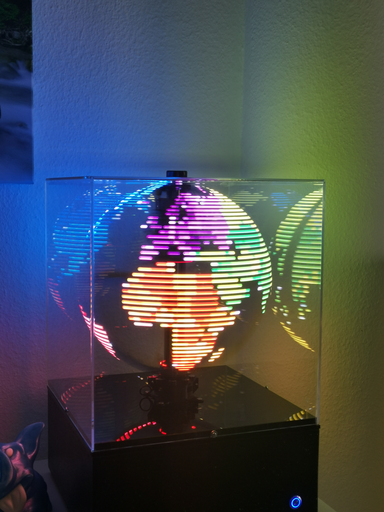</td>
    <td> 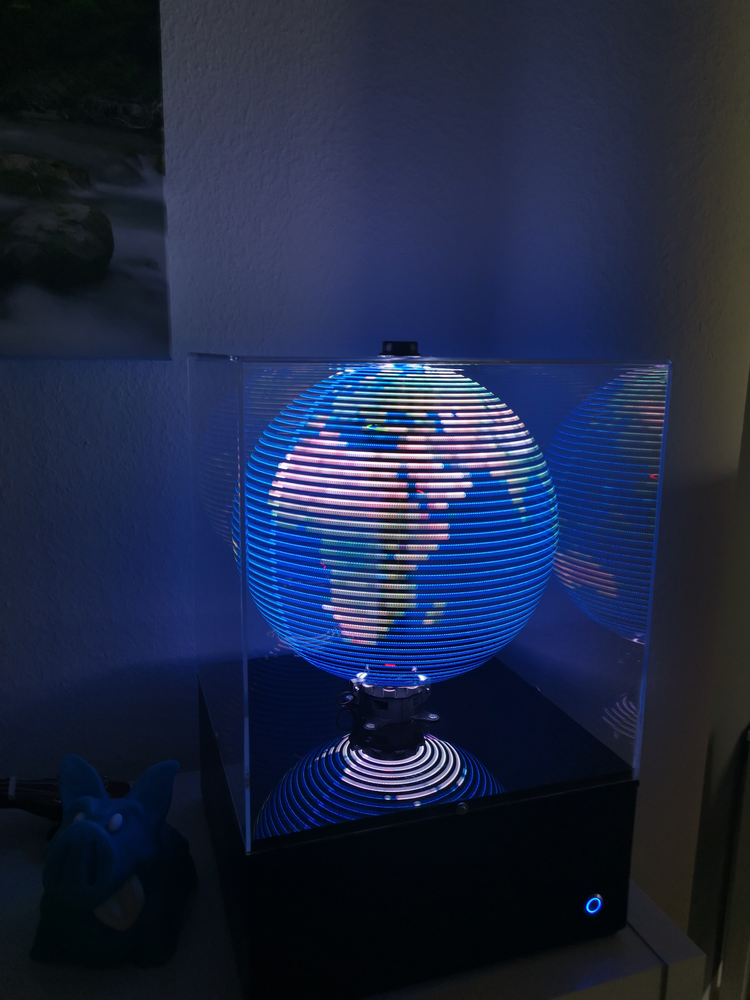</td>
    <td> 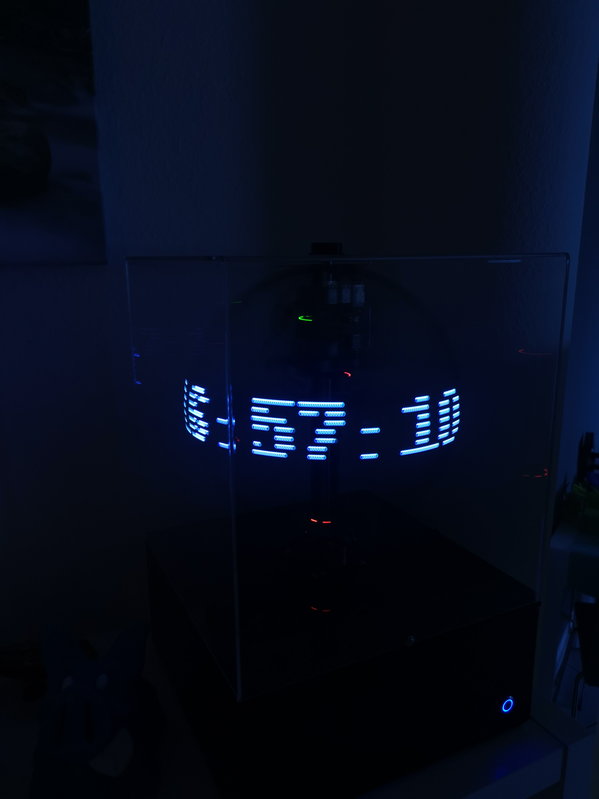</td>
   </tr> 
  <tr>
    <td> 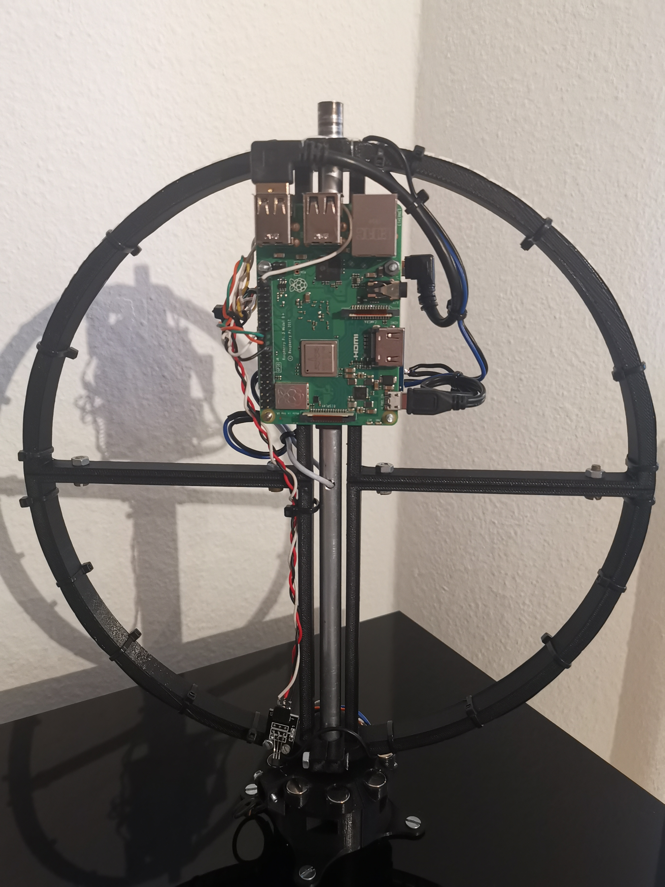</td>
    <td> 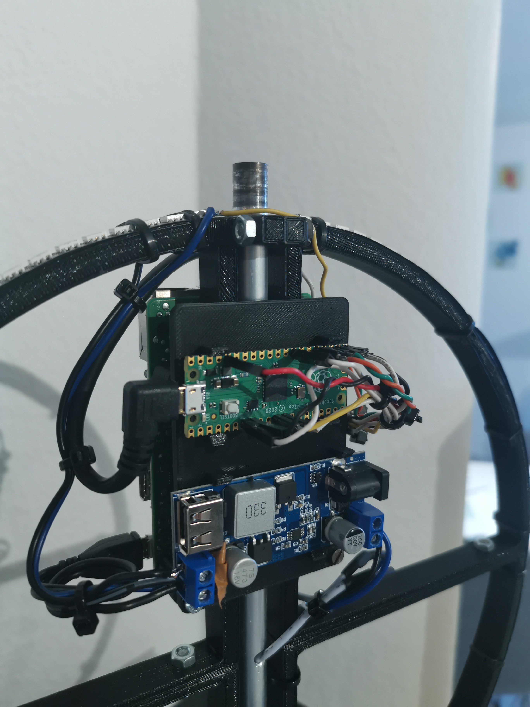</td>
    <td> 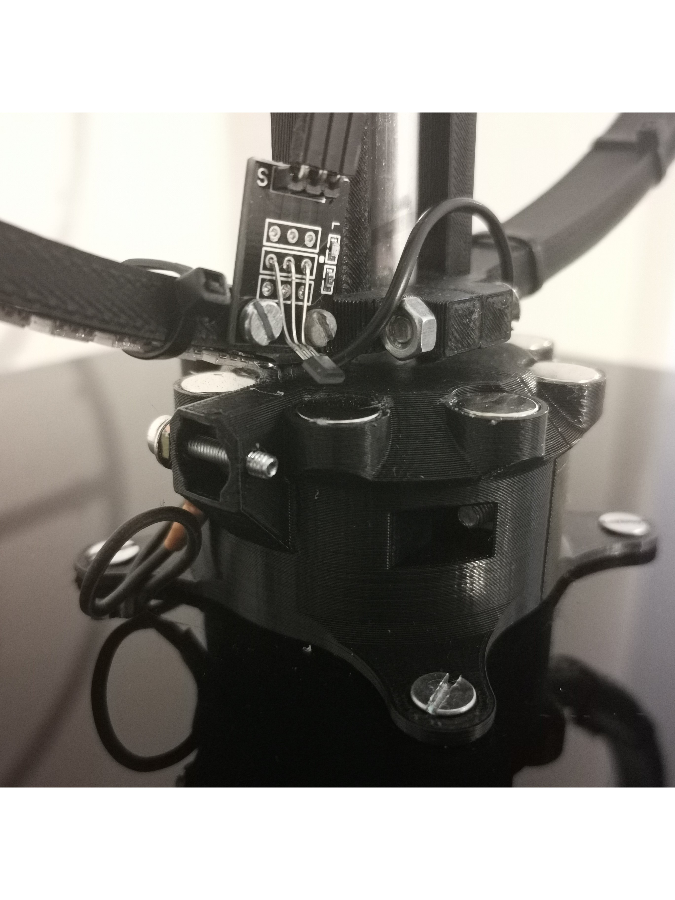</td>
   </tr> 
</table>

### Screenshots from the Web Ui
<table>
  <tr>
    <td rowspan=2> </td>
    <td> 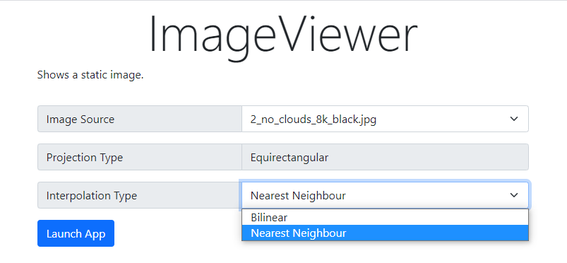</td>
   </tr> 
    <tr>
        <td> 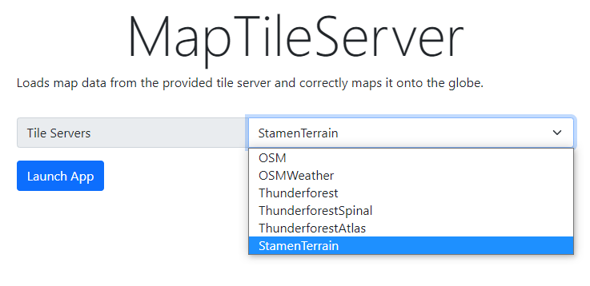</td>
    </tr>
</table>

### Screenshots from the Simulation Framework
<table>
  <tr>
    <td> </td>
    <td> 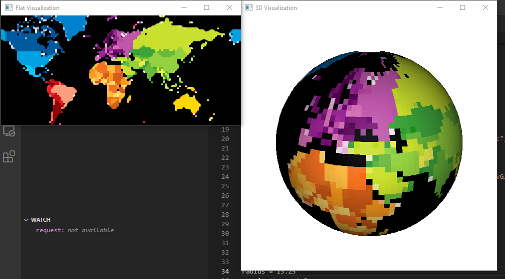</td>
   </tr> 
  <tr>
    <td> 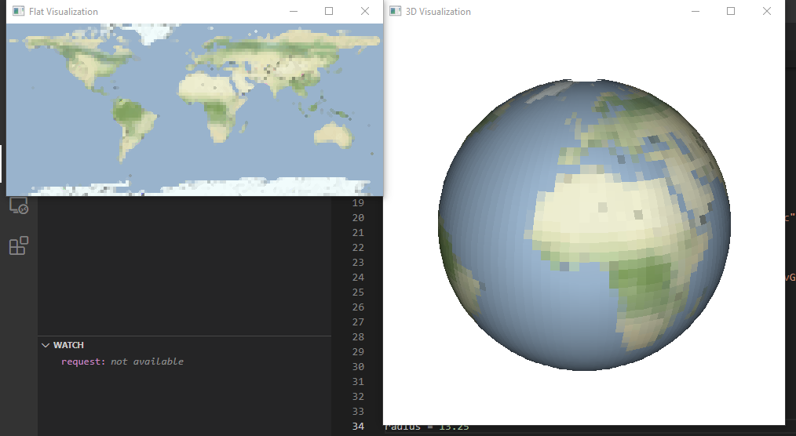</td>
    <td> 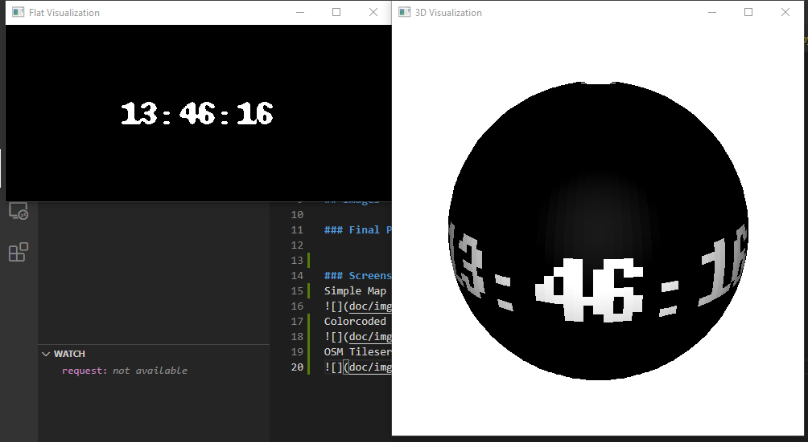</td>
   </tr> 
</table>
